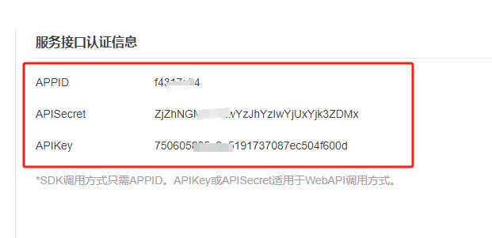
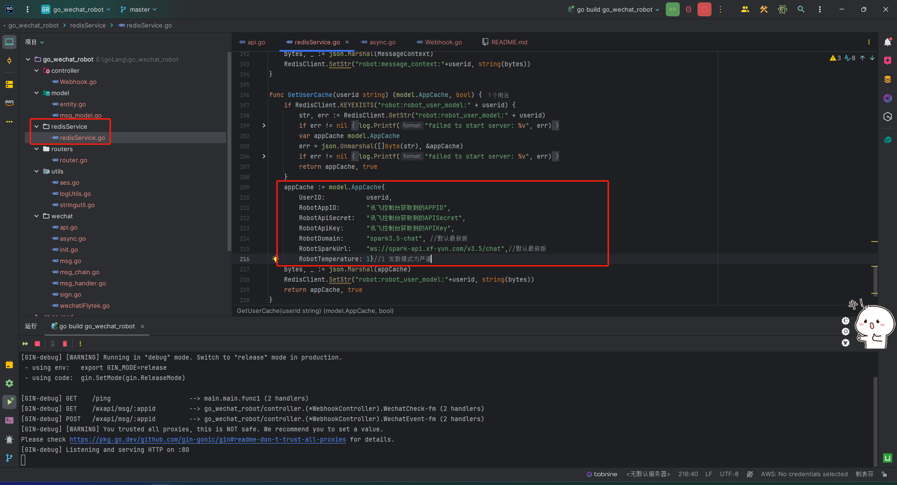
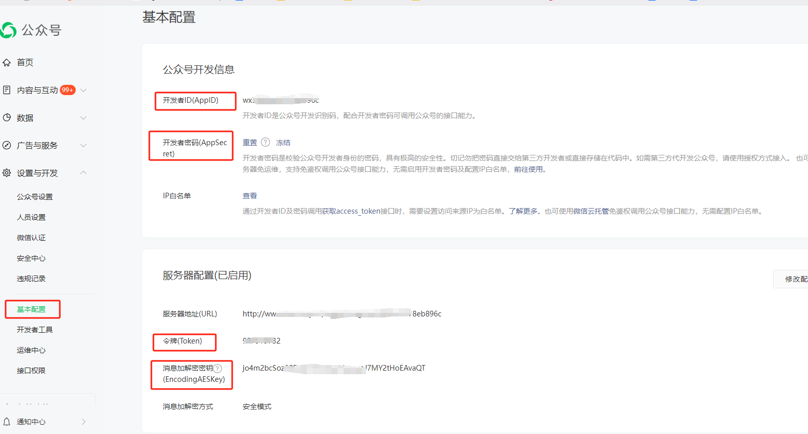
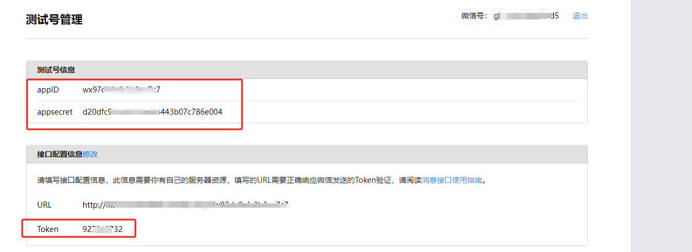

# 基于GO 语言 实现微信服务公众号机器人讯飞星火大模型接入
## 公众号类型必须为已认证的服务号或 公众平台测试账号
[公众平台测试账号申请点我](http://mp.weixin.qq.com/debug/cgi-bin/sandbox?t=sandbox/login&token=1783321109&lang=zh_CN)
## 1 讯飞服务接口认证信息获取
在讯飞开放平台获取服务接口认证信息 [直接点我](https://console.xfyun.cn/services/iat)

最新文档 [点我直达](https://www.xfyun.cn/doc/spark/Web.html)

### 设置大模型默认参数


## 2 公众号开发信息获取
在微信公众平台获取公众号开发信息 [直接点我](https://mp.weixin.qq.com/advanced/advanced?action=dev&t=advanced/dev&token=1783321109&lang=zh_CN)


调用：/wxapi/save/appid 将凭证信息储存至redis


```json
{"appid":"开发者ID(AppID)",
  "app_secret":"开发者密码(AppSecret)",
  "token":"令牌(Token)",
  "aes_key":"消息加解密密钥(EncodingAESKey)"}
```

## 注：使用公众平台测试账号进行测试时，可不用填写aes_key



## 3 redis 连接信息初始化


